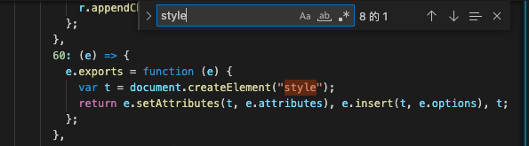
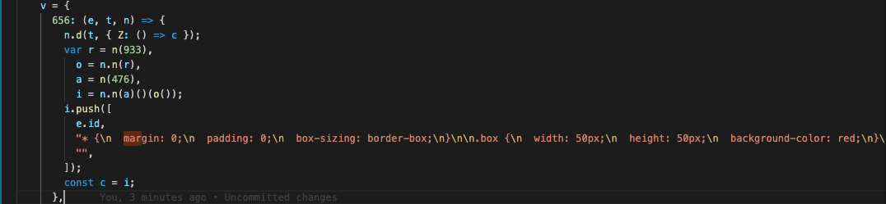
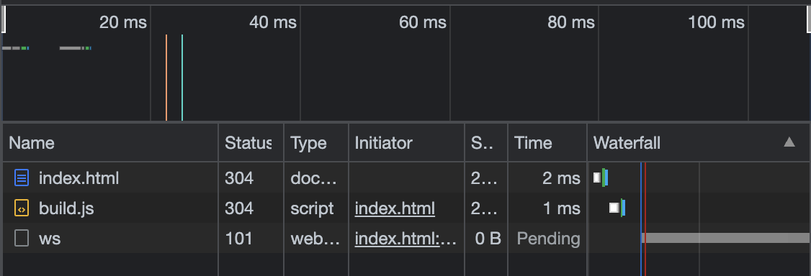
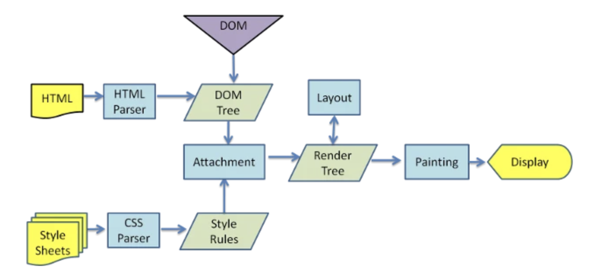
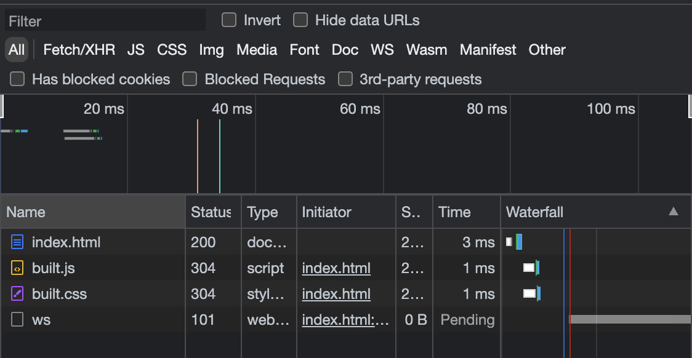
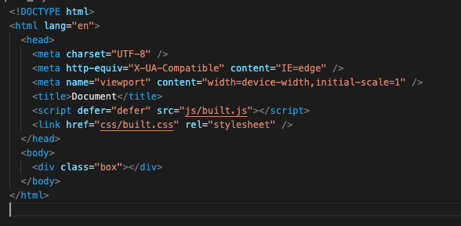
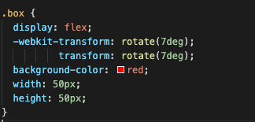

# webpack Css 篇

### 目錄

1.1 我們要先知道的事 <br>
1.2 讓 css 生效<br>
1.3 更好的做法<br>
1.4 支援瀏覽器版本<br>
1.5 總結<br>

### 1.1 我們要先知道的事

1. webpack 只看得懂 js
2. 檔案結構

```js
├─ webpack_css篇
│  ├─ build
│  │  └─ build.js
│  ├─ src
│  │  ├─ index.css
│  │  ├─ index.html
│  │  └─ index.js
│  └─ webpack.config.js
```

3. 內容設定

step1: 先寫好 css

```css
.box {
  width: 50px;
  height: 50px;
  background-color: red;
}
```

step2: 在 js 中引入寫好的 css

```js
import "./index.css";
```

step3: 在 html 引入 js

```html
<!-- html -->
<!DOCTYPE html>
<html lang="en">
  <head>
    <meta charset="UTF-8" />
    <meta http-equiv="X-UA-Compatible" content="IE=edge" />
    <meta name="viewport" content="width=device-width, initial-scale=1.0" />
    <title>webpack css</title>
  </head>
  <body>
    <div class="box"></div>
  </body>
  <script type="module" src="./index.js"></script>
</html>
```

step4: 設定 webpack.config.js

```js
// webpack.config.js
const { resolve } = require("path");

module.exports = {
  entry: "./src/index.js",
  output: {
    filename: "build.js",
    path: resolve(__dirname, "build"),
  },
  module: {
    rules: [
      {
        test: /\.css$/,
        use: [
          // ***在這裡設定要用的功能***
        ],
      },
    ],
  },
  plugins: [],
  mode: "development",
};
```

### 1.2 讓 css 生效

#### css-loader

現在當你用 live mode 打開 index.html 時，你會發現：

- 畫面沒有正確顯示你剛剛所寫的 css，而且還報錯

因為我們忘了一件事：**_webpack 看不懂 css_**

這時候 css-loader 就出現啦～他可以：

- 將 css 文件以字串的形式變成 common.js 的模組，然後 insert 到 js （common.js ）中

所以我們新增一下 webpack.config.js 的設定（在 use 陣列裡面新增一個 css-loader）：

```js
...
    {
        test: /\.css$/,
        use: [
            "css-loader"
        ],
    },
...
```

並將 html 引入的 js 改為 webpack output 的 js

```html
<script type="module" src="../build/build.js"></script>
```

這時我們運行 webpack 指令後查看 index.html，你會發現：

- 畫面依舊沒有正確顯示你剛剛所寫的 css ，但沒有報錯了

因為我們忘了一件事：**_我們只讓 webpack 讀懂，但沒有叫他引入_**

這時候 style-loader 就出現啦～他可以：

- 創建 style 標籤，將 js 中的樣式添加到 head 中

所以我們新增一下 webpack.config.js 的設定（在 use 陣列裡面新增一個 style-loader）：

```js
...
    {
        test: /\.css$/,
        use: [
            "style-loader",
            "css-loader"
        ],
    },
...
```

小提醒：**_use 陣列中是「由下到上」解析的喔_**

這時我們運行 webpack 指令後查看 index.html，你會發現：

- css 正常顯示

我們可以查看剛剛編譯完的 build/build.js：<br>


build.js 中也順利幫我們 createElement 了，但你會額外發現一件事：<br>


你原本寫好的 css 並沒有被下載 **_而是被轉為字串一併 insert 到 style tag 了_** ，到 console 確認發現的確沒有下載 css 的紀錄，只有 build.js：<br>


所以你的 css 會全部仰賴 js 來做渲染，換句話說：**_你的 css 會等到 js 下載完後才會執行_**

這會造成什麼問題呢？

1. 你的畫面進去時會先空白一陣子
2. 如果 js 一多你的佇列會塞爆，重要的功能會被卡住
3. 你的 js 會隨著 layout 越來越多，體積變得越來越大

對於近幾年興盛的使用者體驗導向來說，這不是一個好的做法，因為瀏覽器的渲染邏輯是這樣的：<br>


那我們要怎麼解決這個問題呢？

### 1.3 更好的做法

**_mini-css-extract-plugin_** 的功用：

- 分離 css 會讓 js 引入更快（因為體積更小）

更改一下 webpack.config.js，把 style-loader 取代掉：

```js
module.exports  = {
...
    module:{
        rules:[
            {
                test: /\.css$/,
                use: [MiniCssExtractPlugin.loader, 'css-loader']
            }
        ]
    },
    plugins:[
        new HtmlWebpackPlugin({
            template:'./src/index.html'
        }),
        new MiniCssExtractPlugin({
            filename: 'css/built.css'
        })
    ],
...
}
```

小提醒：**_HtmlWebpackPlugin 用來 insert css 跟 js，這樣原本的 index.html 就不用引入了_**

這時我們運行 webpack 指令後查看 index.html，你會發現：

1. console 中的 built.css initiator 是 index.html<br>
   

2. html 也正確分離 js 跟 css<br>
   

### 1.4 支援瀏覽器版本

接著，為了讓我們寫的 css 能在各大瀏覽器順利運行，我們需要用到 **_postcss-preset-env_**

更改一下 webpack.config.js，新增 postcss-loader：

```js
module.exports = {
  entry: "./js/index.js",
  output: {
      ...
  },
  module: {
    rules: [
      {
        test: /\.css$/,
        use: [
          MiniCssExtractPlugin.loader,
          "css-loader",
          {
            loader: "postcss-loader",
            options: {
              postcssOptions: {
                ident: "postcss",
                plugins: [require("postcss-preset-env")()],
              },
            },
          },
        ],
      },
    ],
  },
  plugins: [
      ...
  ],
  mode: "production",
};

```

```css
.box {
  display: flex;
  transform: rotate(7deg);
  background-color: red;
  width: 50px;
  height: 50px;
}
```

然後在 package.json 裡面增加(版本可以自己調整)：

```js
"browserslist": {
    "development": [
    "last 1 chrome version",
    "last 1 firefox version",
    "last 1 safari version"
    ],
    "production": [// default
    ">0.2%",
    "not dead", // 不用支援已經停止的瀏覽器
    "not op_mini all"
    ]
}
```

這時我們運行 webpack 指令後查看 css 檔案，你會發現： <br>


- transform 被轉換了

### 1.5 總結

css 最常用到的 loader 大概是：

1. postcss-loader
2. MiniCssExtractPlugin
3. css-loader

額外的功能如：

1. cssMinimizerWebpackPlugin
2. 其他

可以自行安裝然後 insert 進 plugins 直接運行，直接運行～～
